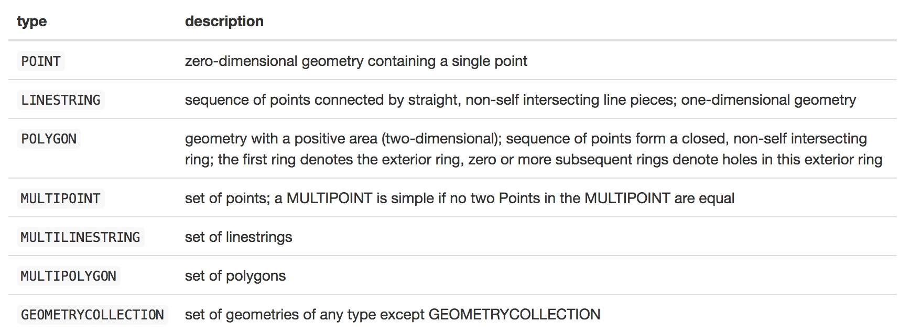

# Spatial Data Basics with sf in R (Part 1)

This jupyter notebook contains the code and documentation for part 1 of the "Spatial Data Basics with sf in R" workshop with R-Ladies RTP.

All of the code that was used to create this tutorial can be found on GitHub here: https://github.com/sheilasaia/sf-workshop-rladies. Please contact Sheila Saia via Meetup or in the Zoom chat during the workshop, if you have any questions.

Special thanks to Dallas Hoffman for all their feedback and help with running this multi-part workshop!

## Learning Outcomes

By the end of part 1 of the workshop attendees will be able to:

1. **describe** key aspects of spatial data that are important for spatial data analysis (i.e., dsata types, formats, and coordinate reference systems)
2. **describe** what the `sf` package can and cannot do, including some initial practice with using it.

Meetup page for Part 1: https://www.meetup.com/rladies-rtp/events/285489478/

## What is Binder? What is a jupyter notebook?

*Binder* (https://mybinder.org) is an open-source interactive codeing planform that simplifies code instruction. It's free to use and best of all it is accessible to anyone with an internet browser and internet connection. You do no need to install any software on your computer. If you want to work on your own computer later, you can download the whole binder space to your computer and you'll have all the code there for later.

*Jupyter notebooks* are a coding language agnostic, interactive coding interface that accessible through any internet browers. If you've used RMarkdown before, it's very similar to this in that it has code chucks and markdown (or text) chunks. In this case, we've set our jupyter notebook up to understand R, but we can set it to recognize other coding languages like Python, Julia, etc.!

### Discussion Questions

1. How many people have heard of Binder before?
2. How many people have used it?
3. How many people have heard of jupyter notebooks before? 
4. How many people have used them?

## Tour of Binder

- side panel
- notebook
- notebook header panel

**Note** A Binder session will timeout after 15 minutes of activity. Also, you will not be able to save your work in your Binder session BUT! you can save your work by downloading it to your computer.

## Coding: Notebook Test

Let's try writing some code in R and see what happens.

Try to do the following:

1. load the `tidyverse` R package using the `library()` function.
2. create a variable `x` and assign it a vector of numeric values 1, 2, and 3.
3. add 1 to `x` and print the result
4. check the data type (i.e., class) of x

```{r}
# load the tidyverse package
# your code here
library(tidyverse)
```

```{r}
# create a variable x and assign it a vector of numeric values 1, 2, 3
# your code here
x <- c(1, 2, 3)
```

```{r}
# add 1 to x and print the result
# your code here
print(x + 1)
x + 1
```

```{r}
# check the class of x
# your code here
class(x)
```

## What is Geospatial Data?

Geospatial data refers to any data that is associated with a location on Earth (or another planet). Usually this means that the data has coordinates (i.e., latitude and longitude or easting and northing).

## Two Major Types of Spatial Data

There are two main types of geospatial data:

1. vector data - points, lines, polygons
2. raster data - pixels (grid) where each grid cell represents a single attribute value

### Discussion Questions

1. Can you think of examples of vector and raster data in your field?
2. What are some example file extensions for vector and raster data (spatial and non-spatial)?

## Categories of Vector Spatial Data

Types of geospatial data:

1. points - a single coordinate combination of x and y (or longitude and latitude, respectively)
2. lines - 2 or more points form a line
3. polygons - 2 or more lines form a polygon

Here's an example spatial data figure that you could make in R.


Figure 1. (a) Map of North Carolina with watersheds (grey polygons) and stream gages (black dots). (b) Map of North Carolina with basemap, overlapping watersheds (grey polygons) and overlapping stream gages (black dots).

### Discussion Question

1. Can you identify different types of spatial data in the Figure 1?
2. Can you think of examples of point, line, and polygon data in your field?

## A NOTE on Spatial Data Packages

As far as I know, most R spatial packages either focus on tools for working with vector or raster spatial data. I've tried to list some examples below:

**Some Vector Data Packages**

- sp
- sf*
- sfnetworks

**Some Raster Data Packages**

- raster
- stars*

**One Package That Has Both**

- elevatR*

**Note** Packages with a * next to them will work well with the tidyverse; they stick to tidy data principles.

## The sf R Package

The `sf` package is a popular tool for working with **vector** spatial data in R. The letters of the package name stand for simple features. A good thing to also keep in mind when using the sf package is that it is still under active development, so it's good to make sure you have an up-to-date version every once in a while by reinstalling it (more on installing it later). You can read more about sf [here](https://github.com/r-spatial/sf).

**Some Important Points**

- Was first released in 2016 and it's use is growing rapidly
- Improvement upon the former `sp` package that was developed in 2005
- Regular data frames with an extra list-structured geometry column that are **not** SpatialData objects but are one of three nested main `sf` object classes (see below) represented by S3 datatypes
- "Language independent" standard spatial data structure (ISO standard ISO 19125-1:2004: [https://www.iso.org/standard/40114.html](https://www.iso.org/standard/40114.html))
- Follows tidy data rules and will not change class (though geometry can change) and retain their data
- Tidyverse commands that work with `sf` objects: [https://r-spatial.github.io/sf/reference/tidyverse.html](https://r-spatial.github.io/sf/reference/tidyverse.html)
- Uses spatial indexing, so many spatial query operations are faster
- Cannot be used in operations that require data of class SpatialData (i.e., sp objects) so you'll have to do converting if this is the case using something like `sp_to_sf()`

## sf Object Classes

I won't go over this in too much detail because it's a little wonky for an intro workshop, but sf objects are organized into three main classes and several different geometries, which you can read more about [here](https://r-spatial.github.io/sf/articles/sf1.html). Some of the most common geometries are included in Table 1 below.

In most cases `sf` classes are nested. That is, an `sf` object contains an `sfc` object which contains a `sfg` object (see full description below).

Table 1. Geometries represented in the `sf` package. Source: https://r-spatial.github.io/sf/articles/sf1.html



## Coding: Preparing to Use sf

Let's try some coding.

Try to do the following:

1. What command would you use if you've never used the `sf` and `here` packages on your computer? Write the code to do this, but you don't have to run it.
2. What command would you use use to tell R that you want to start working with the `sf` and here packages?
3. What `sf` function would you use to read in data?

**Note** The `here` package is something we're using here to deal with our path names to different files in the Binder environment project. This package is a great and reproducible alterative to using `setwd()`. For more on this see, Jenny Brian's passionate tweet and blog post [here](https://twitter.com/jennybryan/status/940436177219338240?lang=en). You can also check out the package documentation [here](https://here.r-lib.org/) for more helpful information.

```{r}
# install the sf package
# your code here
# install.packages("sf")
# install.packages("here")
```

```{r}
# load the sf and here libraries
# your code here
library(sf)
library(here)
```

```{r}
# look up the function to read in vector spatial data
# your code here
?st_read()
# look in help window under the sf package
```

## Spatial Data Exploration

Let's look at the spatial data in the data folder of this Binder environment.

### Discussion Questions

1. Navigate to the data > se_state_bounds folder in your Binder environment. How many files do you see?
2. Which is the most important one? Which one do we use when we read in the data?
3. What do you think this spatial data is?
4. Which one of the three types of vector data do you think these data are represented by?

Using the reading in function we figured out previously, let's try to look at the data a bit.

## Coding: Reading In and Checking Our Data

Try to do the following:

1. Read in the data and assign it to a variable called `se_bounds`. Hint: the path to the data can be represented as `here::here("data", "se_state_bounds", "se_bounds.shp")`.
2. Use `class()` to check out the class of `se_bounds`.
3. Use `names()` to get the attribute column names of `se_bounds`. What do you notice about the last column name?

```{r}
# check the path
here::here("data", "se_state_bounds", "se_bounds.shp")
```

```{r}
# read in shp file and assign to se_bounds
# add your code here
se_bounds <- st_read(here::here("data", "se_state_bounds", "se_bounds.shp"))
```

```{r}
# check the class of se_bounds
# add your code here
class(se_bounds)
```

```{r}
# check the column names of se_bounds attributes
# add your code here
names(se_bounds)
```

```{r}
# let's plot the data to see what it looks like
ggplot(data = se_bounds) +
  geom_sf()
ggsave(here::here("outputs", "se_bounds_map.png"), device = "png", dpi = 50)
```

We stopped here for the part 1 section of the workshop and will pick up with CRSs in part 2.

## Coordinate Reference Systems (CRSs)

A coordinate reference system (CRS) is a mathematical framework that we use to take a 3D object (in this case, the Earth) to a 2D surface (in this case, a map). Folks working with spatial data need to pay attention to CRSs because they tell us **where and how** our data are located on the Earth's surface.

There are two specific components to each CRSs:

1. geographic coordinate system (GCS) - describes **where** to put data on the Earth's surface, a framework that relates the location of data on the actual Earth (which is not completely smooth) to a sphere or model of the Earth's 3D surface, units are expressed in degrees (e.g., latitude and longitude), some examples may include World Geodetic System 1984 (WGS84) and North American Datum 1983 (NAD83) 
2. projected coordinate system (PCS) - describes **how** to put data from a 3D model of the Earth's surface (i.e., the GCS) onto a 2D surface like a map, the math used to do this conversion depends on the projection as do the units (e.g., meters)

See this blog post by H. Smith from ESRI for more information on GCSs and PCSs [here](https://www.esri.com/arcgis-blog/products/arcgis-pro/mapping/coordinate-systems-difference/).


Figure 2. Schematic depicting framework for GCSs and PCSs from the surface of the Earth to a 2D map.

## More on Projected Coordinate Systems

There are three major types of projections:

1. cylindrical
2. conical
3. planar

Each projection type preserves unique spatial properties (Figure 3). You should choose the projection you use based on what spatial property (i.e., distance, area, angle) you want to preserve. For more on this see [here](https://docs.qgis.org/testing/en/docs/gentle_gis_introduction/coordinate_reference_systems.html#figure-projection-families). [This webpage](https://imgur.com/r/mapporn/GORHW4t) also shows how several different projections distort images in space (notice how the orange circles change shape and size?) using [Tissot's indicatrix](https://en.wikipedia.org/wiki/Tissot%27s_indicatrix) method.


Figure 3. Depiction of different spatial projections. Source: https://docs.qgis.org/

[This website](http://www.geo.hunter.cuny.edu/~jochen/gtech201/lectures/lec6concepts/map%20coordinate%20systems/how%20to%20choose%20a%20projection.htm) is also very old looking but has a very helpful summary chart at the bottom for what types of projections to use when.

## Coding: Checking the CRS

Try to do the following:

1. Load the libraries we'll need for today: `tidyverse`, `here`, and `sf`.
1. Use `st_read()` to read in `nc_bounds.shp` and `nc_bounds_utm.shp` and assign them to `nc_bounds` and `nc_bounds_utm` respectively. Hint: Look for "User input" at the top for the name of the CRS.
2. Use `st_crs()` to look up the CRS of both these files. What are they?

```{r}
# load the libraries
# add your code here
library(tidyverse)
library(here)
library(sf)
```

```{r}
# read in the two spatial datasets
# add your code here
nc_bounds <- st_read(here::here("data", "se_state_bounds", "nc_bounds.shp"))
nc_bounds_utm <- st_read(here::here("data", "se_state_bounds", "nc_bounds_utm.shp"))
```

```{r}
# look at the crs of both
# add your code here
st_crs(nc_bounds)
st_crs(nc_bounds_utm)

# one is 5070 (CONUS Albers Equal Area Conic) and the other is 26917 (UTM Zone 17N)
```

Let's also look at them together on the same map.

```{r}
# let's plot the data to see what it looks like
ggplot() +
  geom_sf(data = nc_bounds, fill = "grey50") +
  geom_sf(data = nc_bounds_utm, color = "blue", fill = NA)

ggsave(here::here("outputs", "nc_bounds_issue_map.png"), device = "png", dpi = 50)
```

They are both lining up...this time. But let's use st_area() to compare their areas.

```{r}
# use st_area() to compare their areas (in square miles)
as.numeric(st_area(nc_bounds))/2.58e6
as.numeric(st_area(nc_bounds_utm))/2.58e6

# they are about 40 square miles different
```

The total area of NC is 53,819 square miles according to [Wikipedia](https://en.wikipedia.org/wiki/North_Carolina).

Here's another example of what it might look like if you try to map two different CRSs together (Figure 4, from [Greco 2018](https://www.tandfonline.com/doi/full/10.1080/10095020.2018.1536406)). You can see how this would cause issues with data analysis down the line, since you're often relying on spatial overlap.


Figure 4. Taken from Figure 1 of Greco (2018). Shows projected and not projected overlays of United States boundaries.

## Why Care About CRSs?

1. R does not manage CRSs "on the fly" like ArcGIS/ESRI - The onus is on you to manage the CRS (and extent, resolution, etc.) of your data. Many times this will mean that when attempting to work with two or more data (e.g., extract values to points from a set of shape files), you will get an error message that the data do not share projects and/or they do not align when you try to plot them. Often you can also not get an error message but your data might not be showing up on your map correctly (e.g., spatial boundaries are not lining up).

2. Your analysis will not be correct - If things are not lining up properly then you're not going to be able to truly and accurately leverage spatial tools that rely on CRSs being the same (e.g., your comparing apples and apples, not apples and oranges)

**Note** The most important thing you can take away from this workshop today is to care about/pay attention to your CRSs (geographic coordinate system and projected coordinate systems) and make sure they are always consistent for all datasets you work within the same analysis.

**Note Note** I find CRS management to be one of the time consuming parts of spatial data work in R. At the start of any spatial data project, you may wish to establish a set of reference data objects (e.g., my_ref_crs.shp) to serve as a template for the official projection, extent, origin, resolution, etc.  When you import any data to R, you should always check if it matches my_ref_crs.shp and, if not, proceed to re-project, crop, clip, resample, align. Whatever steps are necessary to make it conform to the project template.

## Typical Workflow for Starting Spatial Analysis

1. Pick a CRS that's best for your work/analyses. You can use https://epsg.io to help you find the standarized CRS number (this is called an EPSG code) for one that you want to use if you don't already know it.
2. Check the CRS of all datasets using `st_crs()`.
3. Convert those that are not in your preferred CRS (from step #1) to that preferred CRS using `st_transform()` and the CRS code as an argument inside like `crs = YOUR_EPSG_CODE_HERE`.
4. Check that all transformed CRSs were actually transformed using `st_crs()`.
5. Do your spatial analyses! :)

**Note** In some rare cases you'll know the CRS but R is not recognizing it. For these cases you can use `st_set_crs()` BUT be very careful not to use `st_set_crs()` unless you are **100% sure** that you already know your data has a specific CRS. This command will override an existing CRS!

## Coding: Checking the CRS and Changing It

Try to do the following:

1. Re-check the CRS of `nc_bounds_utm`
2. Re-project the CRS of `nc_bounds_utm`to the same CRS as `nc_bounds` and assign the transformed `nc_bounds_utm` to a variable called `nc_bounds_transform`.
3. Check that you indeed did transformed the CRS of `nc_bounds_transform`.
4. Look 5070 up on epsg.io. What is is called?

```{r}
# re-check
# add your code here
st_crs(nc_bounds_utm)
```

```{r}
# reproject (or transform) crs
# add your code here
nc_bounds_transform <- st_transform(x = nc_bounds_utm, crs = 5070)
```

```{r}
# check crs of new dataset
# add your code here
st_crs(nc_bounds_transform)
```

```{r}
# look up the crs
# hint hint: https://epsg.io/
# use crs = 5070
# NAD83 CONUS Albers (Equal Area Conic)
```

## Wrap Up and Questions

I hope you are now able to:

1. **describe** key aspects of spatial data that are important for spatial data analysis (i.e., data types, formats, and coordinate reference systems)
2. **describe** what the `sf` package can and cannot do, including some initial practice with using it.

In two weeks, we will take what we learned today and learn more about how to do different spatial operations (e.g., finding the area of things, doing spatial filters based on whether objects overlap in space) and also make some maps!

Sign up for part 2 here: https://www.meetup.com/rladies-rtp/events/286377977/.

### Questions

Please feel free to ask any questions you have about this material before we finish for the evening.

